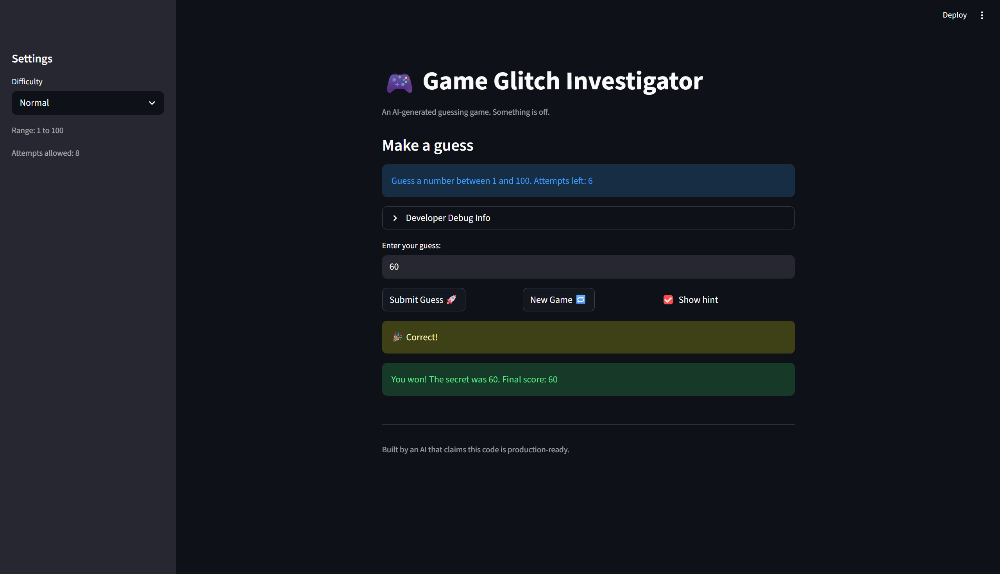
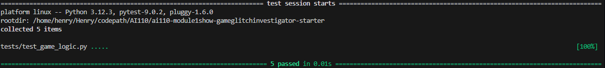

# 🎮 Game Glitch Investigator: The Impossible Guesser

## 🚨 The Situation

You asked an AI to build a simple "Number Guessing Game" using Streamlit.
It wrote the code, ran away, and now the game is unplayable. 

- You can't win.
- The hints lie to you.
- The secret number seems to have commitment issues.

## 🛠️ Setup

1. Install dependencies: `pip install -r requirements.txt`
2. Run the broken app: `python -m streamlit run app.py`

## 🕵️‍♂️ Your Mission

1. **Play the game.** Open the "Developer Debug Info" tab in the app to see the secret number. Try to win.
2. **Find the State Bug.** Why does the secret number change every time you click "Submit"? Ask ChatGPT: *"How do I keep a variable from resetting in Streamlit when I click a button?"*
3. **Fix the Logic.** The hints ("Higher/Lower") are wrong. Fix them.
4. **Refactor & Test.** - Move the logic into `logic_utils.py`.
   - Run `pytest` in your terminal.
   - Keep fixing until all tests pass!

## 📝 Document Your Experience

- Describe the game's purpose.  

   The purpose of the game is to create an interactive number-guessing experience where the player tries to guess a randomly generated secret number between 1 and 100. The application provides hints such as “go higher” or “go lower” to help the player narrow down the correct number. It also tracks the number of attempts and calculates a score based on the player's guesses. The game is built using Streamlit so that users can interact with it through a simple web interface with buttons and an input field.

- Detail which bugs you found.

   When the game was first run, several bugs affected the gameplay and user experience. Pressing the Enter key did not submit the user’s guess, forcing players to rely only on the button interaction. The hint system was incorrect—when the secret number was 38, entering guesses like 55 or 115 incorrectly prompted the player to go higher instead of lower. The app also allowed guesses outside the intended range (1–100) without warning the player, which caused confusing hints. Additionally, after winning and clicking New Game, the message saying “You already won. Start a new game to play again.” remained on the screen even though the game state had reset. Finally, the scoring system behaved inconsistently, sometimes producing negative scores or awarding positive points for incorrect guesses.

- Explain what fixes you applied.

   Several fixes were applied to correct the game's behavior and improve the user experience. The hint logic was corrected so the game properly compares the user’s guess with the secret number and provides accurate “higher” or “lower” feedback. Input validation was added to ensure guesses stay within the 1–100 range and provide a message when users enter an invalid value. The scoring formula was also fixed so points are only awarded or deducted according to the intended rules rather than based on incorrect conditions like even-numbered attempts. The persistent message after starting a new game was resolved by resetting the appropriate values in the app’s session state so that the interface reflects the new game properly. Tests using pytest were also run to confirm that the guess comparison and scoring logic worked correctly after the fixes.

## 📸 Demo

<!-- - [ ] [Insert a screenshot of your fixed, winning game here] -->
Screenshort of Winning Game

Screenshot of Passing Tests

## 🚀 Stretch Features

- [ ] [If you choose to complete Challenge 4, insert a screenshot of your Enhanced Game UI here]
